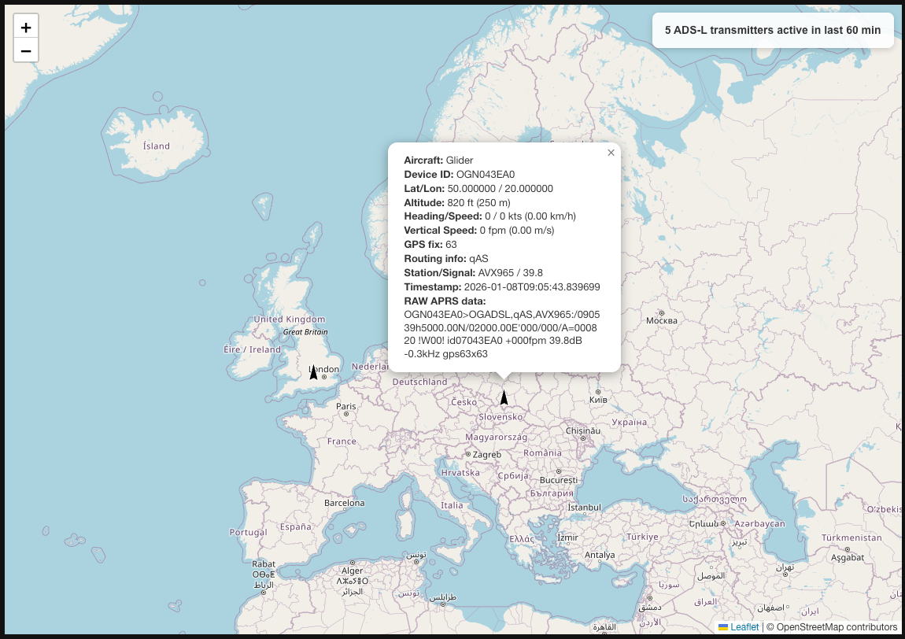
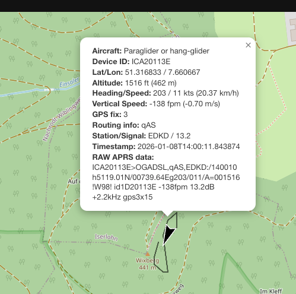

# ads-l-map

This is a simple Flask application for displaying a map of ADS-L devices worldwide.

Data is taken from OGN: https://www.glidernet.org/

## About ADS-L

ADS-L (Automatic Dependent Surveillance – Light) is a tracking system designed for light aircraft, ultralights, paragliders, drones and general aviation operating in non-controlled airspace and inside U-Space. It allows these aircraft to broadcast their position and status, improving situational awareness and safety.

## Project vision

The ADS-L Live Map project aims to provide real-time visibility into the global adoption of ADS-L technology across various aviation segments. By visualizing active devices on an interactive map and tracking historical trends, this project serves as both a monitoring tool for aviation safety and a research resource for understanding ADS-L adoption patterns.

## Key features

- Real-time Tracking: Monitor active ADS-L devices worldwide in real time
- Historical Analytics: Professional charts displaying yearly totals and monthly trends of unique device counts
- Detailed Information: Access comprehensive aircraft data including position, altitude, speed, and more
- Interactive Interface: Zoomable map with dynamic marker scaling for better visualization
- Device Identification: Cross-reference with OGN device database for aircraft model information
- Flight Path Visualization: View the last 10 positions of each aircraft as black trails showing their flight path


## Data sources

This application connects to the Open Glider Network (OGN) APRS data feed, which provides real-time telemetry from ADS-L equipped aircraft worldwide. The device type mapping is sourced from the OGN device database.

## Technical architecture

The application follows a microservice-like architecture with:
- A Flask web server handling HTTP requests
- A persistent TCP connection to the OGN APRS feed
- Background threads for data processing and periodic updates
- Optional MySQL database integration for historical statistics

## Performance considerations

- The application maintains an in-memory cache of active devices
- Old devices (inactive for >60 minutes) are automatically pruned
- Device type mapping is refreshed hourly from the OGN database
- The map interface uses client-side rendering for smooth zooming and panning

## Security

- The application implements proper connection handling with TCP keepalive
- Database connections are secured with environment variables
- All external requests are properly validated and error-handled

## Contributing

Contributions to improve the ADS-L Live Map are welcome! Please:
- Fork the repository
- Create a feature branch
- Submit a pull request with clear documentation

## License

This project is licensed under the MIT License - see the LICENSE file for details.

## Contact

For questions or feedback, please open an issue in the GitHub repository.

## Screenshots






## Live deployment

Visit: https://www.saccani.net/ads-l-real-time-monitoring/

## System Requirements

- Python 3.12+
- MySQL 5.7+ (optional, for statistics)
- Sufficient memory to handle thousands of concurrent device records (100Mb+)
- Sufficient bandwidth to handle the data feed in busy days (6-700 Kbps)

## Metrics

The application tracks and visualizes:
- Number of active devices in the last 60 minutes (displayed in real-time counter)
- Total unique devices observed per year (displayed in bar chart)
- Monthly unique device counts for the last 12 months (displayed in line chart with trend visualization)
- Device distribution by type and region
- Flight paths: Black trails showing the last 10 positions of each aircraft


## API Endpoints

### `/ads-l-map`
**Method:** GET
**Description:** Serves the main map interface
**Usage:** Open in browser to view the interactive map

### `/ads-l/`
**Method:** GET
**Description:** Returns JSON data of all active ADS-L devices

### `/ads-l/stats`
**Method:** GET
**Description:** Returns monthly statistics of unique devices (displayed as interactive charts on the map page)

### `/device-map`
**Method:** GET
**Description:** Returns the device type mapping

## Browser Usage

1. **View the Map**:
    - Open your browser and navigate to `http://localhost:5000/ads-l-map`
    - This will display an interactive map showing all active ADS-L devices

2. **Access Raw Data**:
    - Visit `http://localhost:5000/ads-l/` to view the JSON data of all devices
    - This is useful for debugging or integrating with other applications

3. **View Statistics**:
    - Go to `http://localhost:5000/ads-l/stats` to see monthly device statistics

4. **Device Information**:
    - Access `http://localhost:5000/device-map` to view the device type mapping


## Local environment configuration

Local secrets are stored in the .env file in the project folder. This file must be created before running the program
```
DB_USER=database_uer
DB_PASSWORD=database_password
```

## Running for Testing

To run the application for testing purposes, use the following command:

```bash
gunicorn -w 1 -b 127.0.0.1:5000 --reload --log-level debug --capture-output app:app
```

## Running for Production

For production, you can use systemd to manage the application.

Create a systemd service file (e.g., `/etc/systemd/system/ads-l-map.service`):

```ini
[Unit]
Description=ADS-L Live Map Service
After=network.target

[Service]
User=your_username
Group=your_group
WorkingDirectory=/path/to/ads-l-map
ExecStart=gunicorn -w 1 --threads 2 -k gthread --timeout 0 -b 127.0.0.1:5000 app:app
Restart=always
RestartSec=5
LimitNOFILE=4096

[Install]
WantedBy=multi-user.target
```

Then enable and start the service:

```bash
sudo systemctl enable ads-l-map.service
sudo systemctl start ads-l-map.service
```

## Python Requirements

Install the required packages using:

```bash
pip install -r requirements.txt
```

If you prefer to use a virtual environment:
```bash
python -m venv venv
source venv/bin/activate
pip install -r requirements.txt
```

Database table for monthly statistics (can be disabled by setting SKIP_STATS_DATABASE to True)
```sql
CREATE TABLE `monthly_devices` (
  `month` char(7) NOT NULL,
  `device_id` varchar(16) NOT NULL,
  `device_type` enum('ADSL','ADSB','FLARM','OTHER') NOT NULL,
  `first_seen` datetime NOT NULL,
  PRIMARY KEY (`month`,`device_id`),
  KEY `idx_month_type` (`month`,`device_type`)
) ENGINE=InnoDB DEFAULT CHARSET=utf8mb4 COLLATE=utf8mb4_general_ci
```

## Acknowledgements

Special thanks to:
- Open Glider Network for providing the data feed
- Contributors to the OGN device database
- EASA and all the people involved in the ADS-L specification
- Europe-Air-Sports (EAS) and European Hang-Gliding and Paragliding Union (EHPU)
- The aviation community for adopting ADS-L technology