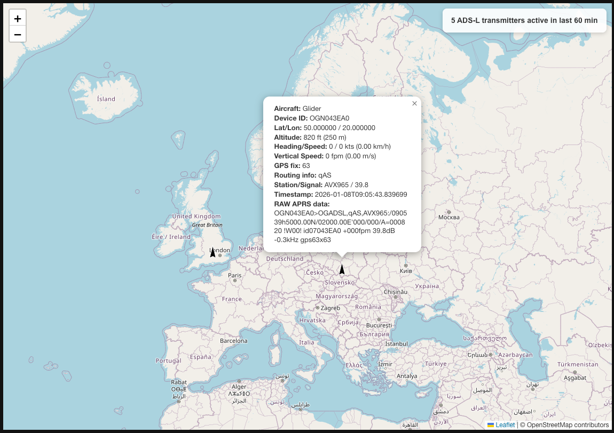
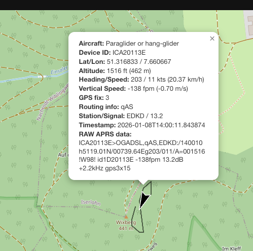
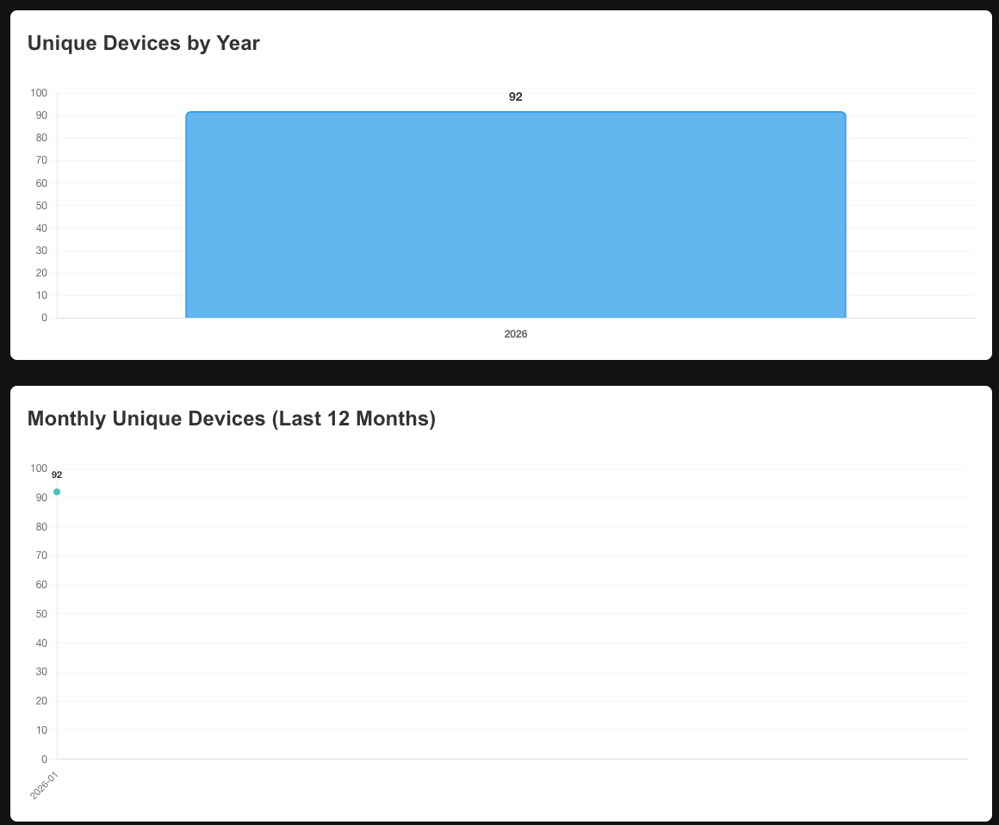

# ads-l-map

This is a simple Flask application for displaying a map of ADS-L devices worldwide.

Data is taken from OGN: https://www.glidernet.org/

## About ADS-L

ADS-L (Automatic Dependent Surveillance – Light) is a tracking system designed for light aircraft, ultralights, paragliders, drones and general aviation operating in non-controlled airspace and inside U-Space. It allows these aircraft to broadcast their position and status, improving situational awareness and safety.

## Project vision

The ADS-L Live Map project aims to provide real-time visibility into the global adoption of ADS-L technology across various aviation segments. By visualizing active devices on an interactive map and tracking historical trends, this project serves as both a monitoring tool for aviation safety and a research resource for understanding ADS-L adoption patterns.

## Key features

- **Real-time Tracking**: Monitor active ADS-L devices worldwide in real time with automatic updates every 5 seconds
- **Historical Analytics**: Professional charts displaying yearly totals and monthly trends of unique device counts
- **Detailed Information**: Access comprehensive aircraft data including position, altitude, speed, heading, vertical speed, GPS fix quality, and signal strength
- **Interactive Interface**: Zoomable map with dynamic marker scaling that adjusts to zoom level for better visualization
- **Device Identification**: Cross-reference with OGN device database for aircraft model and registration information
- **Flight Path Visualization**: View the last 10 positions of each aircraft as black trails showing their flight path
- **Automatic Reconnection**: Persistent connection to OGN feed with automatic reconnection on failure
- **Device Lifecycle Management**: Automatic removal of inactive devices after 60 minutes

### Map Interface Features:

- **Dynamic Aircraft Icons**: Aircraft icons rotate to show heading and scale with zoom level
- **Rich Popups**: Detailed information including raw APRS data for each aircraft
- **Real-time Counter**: Shows number of active ADS-L transmitters in the last 60 minutes
- **Flight Trails**: Black lines showing the last 10 positions of each aircraft
- **Responsive Design**: Adapts to different screen sizes and devices

### Statistics Dashboard:

- **Monthly Chart**: Line chart showing unique devices per month for the last 12 months
- **Yearly Chart**: Bar chart showing total unique devices by year
- **Interactive Tooltips**: Detailed information on hover
- **Data Labels**: Clear value displays on each data point


## Data sources

This application connects to the Open Glider Network (OGN) APRS data feed, which provides real-time telemetry from ADS-L equipped aircraft worldwide. The device type mapping is sourced from the OGN device database.

## Technical architecture

The application follows a microservice-like architecture with:
- A Flask web server handling HTTP requests
- A persistent TCP connection to the OGN APRS feed with automatic reconnection
- Background threads for data processing and periodic updates
- Optional MySQL database integration for historical statistics
- Automatic pruning of inactive devices (older than 60 minutes)
- Hourly updates of device type mapping from OGN database

### Key Processes:

1. **OGN Feed Connection**: Maintains persistent TCP connection to aprs.glidernet.org:14580 with automatic reconnection every 5 seconds if connection fails

2. **Device Management**: 
   - Active devices stored in memory with timestamp
   - Devices inactive for >60 minutes are automatically removed
   - Device type mapping refreshed hourly from OGN device database

3. **Data Processing**:
   - APRS packets parsed for position, altitude, speed, and other telemetry
   - Aircraft type determined from symbol codes or OGN device database
   - Flight trails show last 10 positions of each aircraft

4. **Statistics Collection**:
   - Monthly unique device counts stored in MySQL database
   - Statistics available via API for chart visualization

## Performance considerations

- The application maintains an in-memory cache of active devices
- Old devices (inactive for >60 minutes) are automatically pruned
- Device type mapping is refreshed hourly from the OGN database
- The map interface uses client-side rendering for smooth zooming and panning

## Security

- The application implements proper connection handling with TCP keepalive
- Database connections are secured with environment variables
- All external requests are properly validated and error-handled

## Contributing

Contributions to improve the ADS-L Live Map are welcome! Please:
- Fork the repository
- Create a feature branch
- Submit a pull request with clear documentation

## License

This project is licensed under the MIT License - see the LICENSE file for details.

## Troubleshooting

### Common Issues:

1. **Database connection failed**:
   - Verify MySQL is running: `sudo systemctl status mysql`
   - Check credentials in `.env` file
   - Ensure `monthly_devices` table exists
   - Test connection: `mysql -u [user] -p [database]`

2. **OGN feed connection failed**:
   - Check internet connection
   - Verify port 14580 is not blocked by firewall
   - Test connection: `telnet aprs.glidernet.org 14580`
   - System automatically retries connection every 5 seconds

3. **No devices displayed**:
   - Verify listener is running (check logs for "OGN connection established")
   - Ensure there are active devices in your area
   - Try refreshing the page after a few minutes
   - Check if devices are being parsed (look for "[PARSED]" in debug logs)

4. **Performance issues**:
   - Increase system memory if handling thousands of devices
   - Ensure sufficient bandwidth for OGN feed (6-700 Kbps recommended)
   - Consider reducing update frequency if needed

### Viewing Logs:
The application uses different log levels:
- `INFO`: General status messages and connection information
- `ERROR`: Connection errors and critical issues
- `DEBUG`: Detailed APRS packet information (disabled by default)

To enable detailed logging:
```bash
gunicorn -w 1 -b 127.0.0.1:5000 --log-level debug app:app
```

Or modify the log level in `app.py`:
```python
main_logger.setLevel(logging.DEBUG)  # Change from INFO to DEBUG
logging.getLogger().setLevel(logging.DEBUG)  # Show RAW/PARSED messages
```

### Debugging Tips:

1. **Check active devices**: Visit `/ads-l/` endpoint to see raw JSON data
2. **Verify database records**: `SELECT COUNT(*) FROM monthly_devices;`
3. **Test device mapping**: Visit `/device-map` to see loaded device types
4. **Monitor connection**: Look for "OGN connection established" in logs
5. **Check pruning**: Verify old devices are removed after 60 minutes

## Contact

For questions or feedback, please open an issue in the GitHub repository.

## Screenshots







## Live deployment

Visit: https://www.saccani.net/ads-l-real-time-monitoring/

## System Requirements

- Python 3.12+
- MySQL 5.7+ (optional, for statistics)
- Sufficient memory to handle thousands of concurrent device records (100Mb+)
- Sufficient bandwidth to handle the data feed in busy days (6-700 Kbps)

## Metrics

The application tracks and visualizes:
- Number of active devices in the last 60 minutes (displayed in real-time counter)
- Total unique devices observed per year (displayed in bar chart)
- Monthly unique device counts for the last 12 months (displayed in line chart with trend visualization)
- Device distribution by type and region
- Flight paths: Black trails showing the last 10 positions of each aircraft


## API Endpoints

### `/ads-l-map`
**Method:** GET
**Description:** Serves the main map interface
**Usage:** Open in browser to view the interactive map

### `/ads-l/`
**Method:** GET
**Description:** Returns JSON data of all active ADS-L devices

### `/ads-l/stats`
**Method:** GET
**Description:** Returns monthly statistics of unique devices (displayed as interactive charts on the map page)

### `/device-map`
**Method:** GET
**Description:** Returns the device type mapping

## Browser Usage

1. **View the Map**:
    - Open your browser and navigate to `http://localhost:5000/ads-l-map`
    - This will display an interactive map showing all active ADS-L devices
    - The map automatically updates every 5 seconds

2. **Access Raw Data**:
    - Visit `http://localhost:5000/ads-l/` to view the JSON data of all devices
    - This is useful for debugging or integrating with other applications
    - Data includes complete telemetry for each active device

3. **View Statistics**:
    - Go to `http://localhost:5000/ads-l/stats` to see monthly device statistics
    - Shows unique devices per month for the last 12 months
    - Used to generate the charts on the main map page

4. **Device Information**:
    - Access `http://localhost:5000/device-map` to view the device type mapping
    - Shows aircraft models and registrations from OGN database
    - Updated hourly from the OGN device database

## Known Issues or Areas of Attention

- **OGN Feed Limitations**: The feed may occasionally stall or disconnect, though the application handles this with automatic reconnection
- **Data Precision**: GPS coordinates have limited precision based on the APRS protocol
- **Geographic Coverage**: Device visibility depends on OGN receiver coverage in each area
- **Device Identification**: Some devices may not be properly identified if not in the OGN database
- **Performance**: Handling thousands of concurrent devices may require additional system resources

## Map Legend

### Aircraft Icons:
- **Black Triangle**: Standard aircraft icon
- **Rotation**: Icon rotates to show current heading
- **Size**: Automatically scales with zoom level (smaller at higher zoom, larger at lower zoom)

### Flight Trails:
- **Black Lines**: Show the last 10 positions of each aircraft
- **Line Thickness**: 2px with 60% opacity for better visibility
- **Update Frequency**: Trails update every 5 seconds along with aircraft positions

### Popup Information:
- **Aircraft Type**: Model and registration from OGN database
- **Position**: Latitude and longitude with 6 decimal precision
- **Altitude**: In feet with metric conversion
- **Speed**: In knots with km/h conversion
- **Vertical Speed**: In fpm with m/s conversion
- **GPS Quality**: Fix quality and satellite count
- **Signal Strength**: In dB
- **Raw Data**: Complete APRS packet for debugging

## Security Considerations

### Database Security:
- Always use strong passwords for MySQL users
- Restrict database user permissions to only what's needed
- Consider using environment variables for sensitive credentials
- Rotate passwords regularly in production environments

### Network Security:
- The application binds to localhost by default (127.0.0.1)
- For remote access, use a reverse proxy with HTTPS
- Consider adding authentication for sensitive endpoints
- Monitor and limit API request rates

### Production Recommendations:
- Run behind a reverse proxy (Nginx, Apache)
- Enable HTTPS with Let's Encrypt
- Implement proper firewall rules
- Monitor system resources and logs
- Set up automatic backups for the database


## Local environment configuration

Local secrets are stored in the .env file in the project folder. This file must be created before running the program
```
DB_USER=database_user
DB_PASSWORD=database_password
SKIP_STATS_DATABASE=False  # Set to True to disable database statistics
```

### Initial Setup

1. **Create MySQL database and user:**
```sql
CREATE DATABASE ads_l;
CREATE USER 'ads_l_user'@'localhost' IDENTIFIED BY 'password';
GRANT ALL PRIVILEGES ON ads_l.* TO 'ads_l_user'@'localhost';
FLUSH PRIVILEGES;
```

2. **Create the statistics table:**
```sql
CREATE TABLE `monthly_devices` (
  `month` char(7) NOT NULL,
  `device_id` varchar(16) NOT NULL,
  `device_type` enum('ADSL','ADSB','FLARM','OTHER') NOT NULL,
  `first_seen` datetime NOT NULL,
  PRIMARY KEY (`month`,`device_id`),
  KEY `idx_month_type` (`month`,`device_type`)
) ENGINE=InnoDB DEFAULT CHARSET=utf8mb4 COLLATE=utf8mb4_general_ci
```

## Running for Testing

To run the application for testing purposes, use the following command:

```bash
gunicorn -w 1 -b 127.0.0.1:5000 --reload --log-level debug --capture-output app:app
```

### Development Mode

For development with automatic reloading:

```bash
export FLASK_APP=app.py
export FLASK_ENV=development
flask run
```

### Viewing Logs

The application uses different log levels:
- `INFO`: General status messages and connection information
- `ERROR`: Connection errors and critical issues
- `DEBUG`: Detailed APRS packet information (disabled by default)

To enable detailed logging, modify the log level in the code or use:
```bash
gunicorn -w 1 -b 127.0.0.1:5000 --log-level debug app:app
```

## Running for Production

For production, you can use systemd to manage the application.

Create a systemd service file (e.g., `/etc/systemd/system/ads-l-map.service`):

```ini
[Unit]
Description=ADS-L Live Map Service
After=network.target

[Service]
User=your_username
Group=your_group
WorkingDirectory=/path/to/ads-l-map
ExecStart=gunicorn -w 1 --threads 2 -k gthread --timeout 0 -b 127.0.0.1:5000 app:app
Restart=always
RestartSec=5
LimitNOFILE=4096

[Install]
WantedBy=multi-user.target
```

Then enable and start the service:

```bash
sudo systemctl enable ads-l-map.service
sudo systemctl start ads-l-map.service
```

## Python Requirements

Install the required packages using:

```bash
pip install -r requirements.txt
```

If you prefer to use a virtual environment:
```bash
python -m venv venv
source venv/bin/activate
pip install -r requirements.txt
```

Database table for monthly statistics (can be disabled by setting SKIP_STATS_DATABASE to True)
```sql
CREATE TABLE `monthly_devices` (
  `month` char(7) NOT NULL,
  `device_id` varchar(16) NOT NULL,
  `device_type` enum('ADSL','ADSB','FLARM','OTHER') NOT NULL,
  `first_seen` datetime NOT NULL,
  PRIMARY KEY (`month`,`device_id`),
  KEY `idx_month_type` (`month`,`device_type`)
) ENGINE=InnoDB DEFAULT CHARSET=utf8mb4 COLLATE=utf8mb4_general_ci
```

## Acknowledgements

Special thanks to:
- Open Glider Network for providing the data feed
- Contributors to the OGN device database
- EASA and all the people involved in the ADS-L specification
- Europe-Air-Sports (EAS) and European Hang-Gliding and Paragliding Union (EHPU)
- The aviation community for adopting ADS-L technology